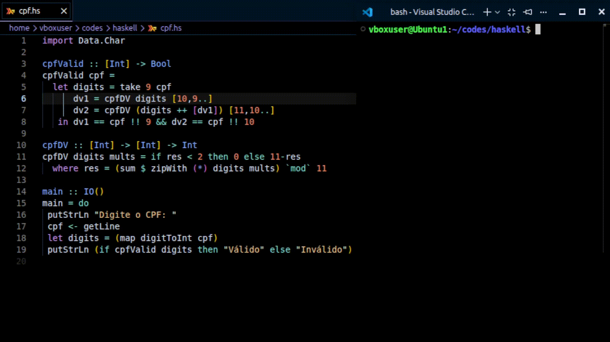
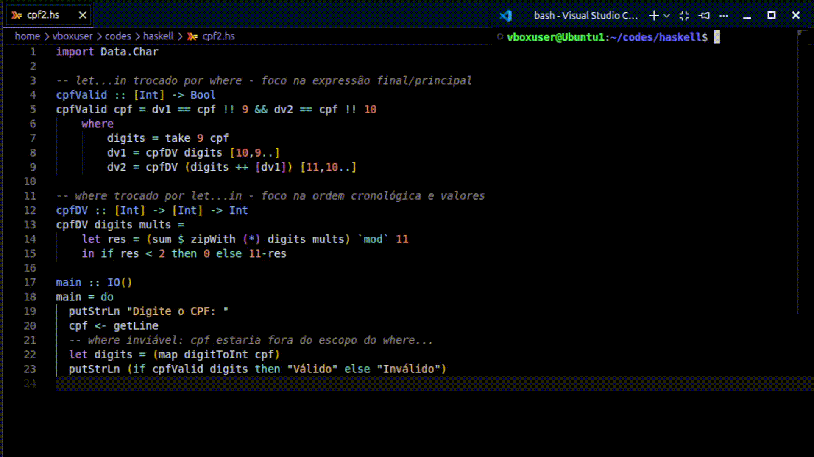

# Atividade aula 8 - Nícolas 
## Parte Teórica - Análise de códigos
### Validação de CPF
  O código de validação de CPF apresentado na aula 08 é simples, mas contêm alguns recursos de sintaxe novos e possivelmente ambíguos e desconhecidos para quem não conhece bem a linguagem.
    
#### Função <i>take</i> → `take :: Int -> [a] -> [a]` 
  Na linha 5, encontramos a função <i>take</i>: `let digits = take 9 cpf`. Essa função retorna os <i>n</i> primeiros números de uma lista. Dessa forma, o código trabalhará somente com 9 números: o padrão do CPF brasilero.
#### Função/operador <i>!!</i> → `(!!) :: HasCallStack => [a] -> Int -> a` 
  Na linha 8, encontramos a função <i>!!</i>: `let digits = take 9 cpf`. Essa função recebe uma lista e retorna o elemento armazenado no índice indicado como argumento. Essa função é classificada como uma função <strong> parcial</strong>,
visto que pode causar erros e quebrar o código.  
  <strong>(EXTRA) HasCallStack e erros</strong>: a função <i>!!</i>, quando causa erro, por ser parcial, pode não indicar o erro. Digamos que o código tente acessar o índice 6 em uma lista com 4 elementos: como <i>!!</i> é uma função parcial que não trata essa situação de índice inválido, o código quebra, porém o terminal pode não indicar onde ocorreu o erro. Para isso serve o <i>HasCallStack</i>: ele funciona como uma restrição para a função. Ele exige que o compilador rastreie 
as chamadas que levaram ao erro, possibilitando a identificação do local do problema.
#### Função <i>getLine</i> →  `getLine :: IO String`
  Na linha 17, a função <i>getLine</i> é responsável por ler o input do usuário, nesse caso, o CPF inserido: `cpf <- getLine`. 
  <strong>OBS</strong>: o operador <i><-</i> é utilizado para "armazenar" o valor de <i>getLine</i> em <i>cpf</i>. Ele é utilizado para essa finalidade quando a obtenção do dado a ser "armazenado" (valor da direita) é proveniente de ações de IO. Caso contrário, operadores como <i>=</i> e <i>let</i> são utilizados.

## Parte Prática - <i>let</i> e <i>where</i> na validação de CPF
  Os operadores <i>let...in</i> e <i>where</i> possuem funções parecidas, mas são diferentes quanto à estrutura e como são lidos e tratados pelo compilador/interpretador. Enquanto o <i>let...in</i> funciona como uma expressão autônoma, ou seja, pode contar como um valor em praticamente qualquer lugar, o <i>where</i> funciona como uma cláusula estrutural, precisando estar conectado a um bloco ou equação. Assim, esses dois operadores no código de validação de CPF explorado são intercambiáveis, desde que a estrutura ao seu redor seja devidamente adaptada à sua função sob a visão da linguagem.
#### Código Original
  
#### Trocando <i>let</i> e <i>where</i>
  
